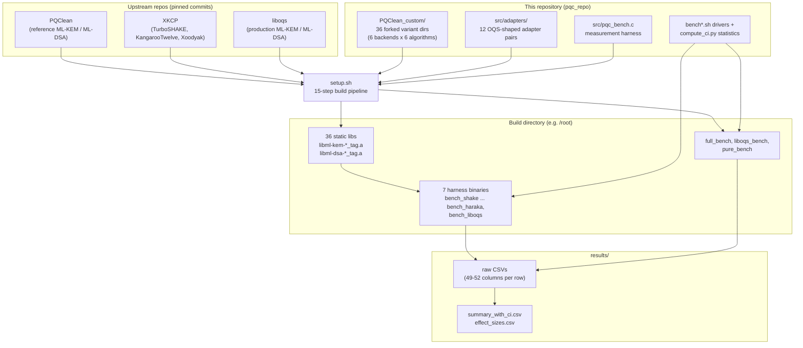
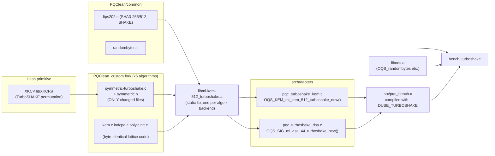
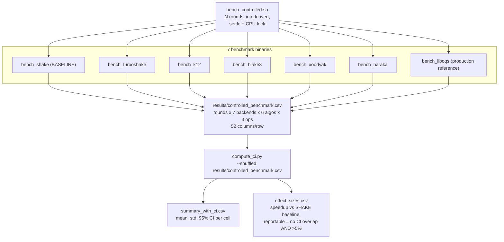
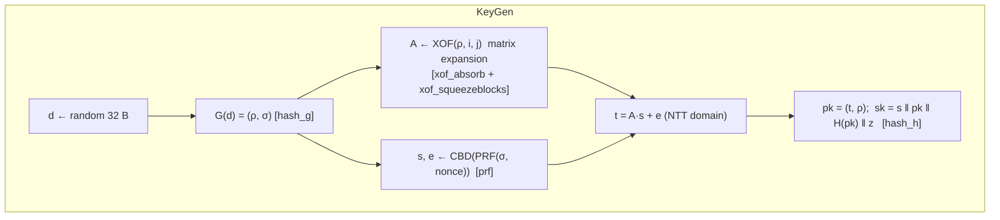
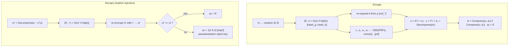
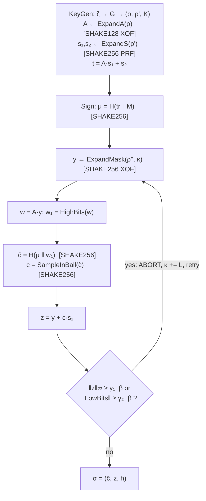
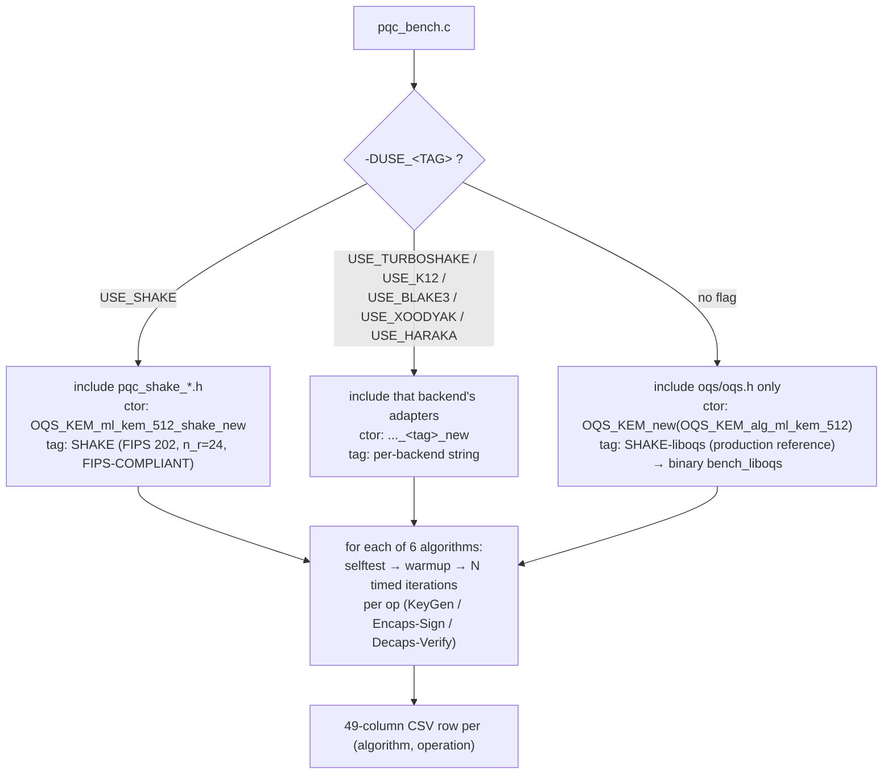
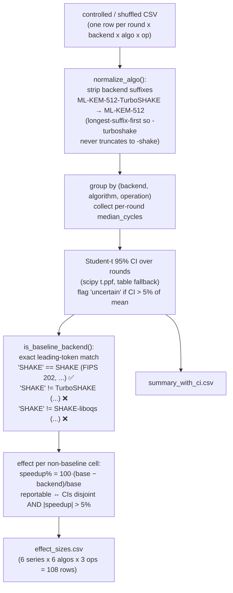

# PQC Hash-Agility Benchmark — Complete Architecture & Implementation Guide

This document explains the **whole system end to end**: what it measures, how every
file connects to every other file, how the build pipeline works, what each
algorithm is and how it works internally, and how the numbers in the CSVs are
produced and analysed.

> Companion documents:
> * [`README.md`](README.md) — quick usage reference.
> * [`IMPLEMENTATION_GUIDE.md`](IMPLEMENTATION_GUIDE.md) — full source-level
>   migration guide (embeds complete source of every custom file).

---

## Table of contents

1. [What this project measures](#1-what-this-project-measures)
2. [Big-picture system flowchart](#2-big-picture-system-flowchart)
3. [Repository map — every file and what it does](#3-repository-map)
4. [How the files connect](#4-how-the-files-connect)
5. [The build pipeline (setup.sh, 15 steps)](#5-the-build-pipeline)
6. [The seven benchmark series](#6-the-seven-benchmark-series)
7. [How a hash backend is swapped in (the `symmetric.h` seam)](#7-the-symmetrich-seam)
8. [The adapter layer (OQS-shaped wrappers)](#8-the-adapter-layer)
9. [Algorithms in detail — ML-KEM (FIPS 203)](#9-ml-kem-fips-203)
10. [Algorithms in detail — ML-DSA (FIPS 204)](#10-ml-dsa-fips-204)
11. [Hash/XOF backends in detail (all 7)](#11-hash-backends-in-detail)
12. [The measurement harness `pqc_bench.c`](#12-the-measurement-harness)
13. [Driver scripts and data flow](#13-driver-scripts-and-data-flow)
14. [Statistics: `compute_ci.py`](#14-statistics-compute_cipy)
15. [Auxiliary experiments (k-sweep, hyperparameters, pure liboqs)](#15-auxiliary-experiments)
16. [How to add a new hash backend](#16-how-to-add-a-new-hash-backend)

---

## 1. What this project measures

ML-KEM (Kyber) and ML-DSA (Dilithium) spend a large fraction of their runtime
**inside a hash function** — SHAKE128/SHAKE256 (Keccak with 24 rounds) is used
to expand seeds into matrices, sample noise, and derive keys. This project asks:

> **What happens to performance, memory, energy, and timing-leakage behaviour
> if you substitute the Keccak-based XOF with a faster (but mostly non-FIPS)
> alternative — while keeping the lattice arithmetic byte-identical?**

To answer that fairly, *everything except the hash* must be identical:

* All six measured backends (`shake`, `turboshake`, `k12`, `blake3`,
  `xoodyak`, `haraka`) are forks of the **same PQClean pinned commit**,
  compiled with the **same Makefile and the same compiler flags**.
* The **baseline is `shake`** — a PQClean fork whose `symmetric-shake.c` is the
  *unmodified upstream* file. It differs from the other five **only** in the
  hash, so any measured delta is pure hash substitution, not library
  engineering.
* A seventh series, **`liboqs-ref`** (binary `bench_liboqs`), runs liboqs's own
  built-in ML-KEM/ML-DSA. It is a *production reference* only — it shows what a
  deployed, optimised library achieves — and is **never used as the baseline**
  in the statistics, because its speed comes from different engineering, not a
  different hash.

---

## 2. Big-picture system flowchart



---

## 3. Repository map

```
pqc_repo/
├── README.md                  Usage reference
├── ARCHITECTURE.md            This document
├── IMPLEMENTATION_GUIDE.md    Source-level migration guide (full file dumps)
├── setup.sh                   One-shot build pipeline (15 steps)
│
├── PQClean_custom/            The 36 forked algorithm variants
│   ├── crypto_kem/ml-kem-{512,768,1024}/{shake,turboshake,k12,blake3,xoodyak,haraka}/
│   └── crypto_sign/ml-dsa-{44,65,87}/{shake,turbo,k12,blake3,xoodyak,haraka}/
│       Each dir = full PQClean 'clean' implementation, namespace-renamed,
│       with only symmetric.h / symmetric-<tag>.c replaced (shake keeps
│       the upstream symmetric-shake.c verbatim → true baseline).
│
├── src/
│   ├── pqc_bench.c            Measurement harness (compiled 7x, one per backend)
│   ├── adapters/              12 pairs of OQS_KEM/OQS_SIG-shaped wrappers
│   │   ├── pqc_shake_kem.{c,h}      pqc_shake_dsa.{c,h}
│   │   ├── pqc_turboshake_kem.{c,h} pqc_turboshake_dsa.{c,h}
│   │   ├── pqc_k12_kem.{c,h}        pqc_k12_dsa.{c,h}
│   │   ├── pqc_blake3_kem.{c,h}     pqc_blake3_dsa.{c,h}
│   │   ├── pqc_xoodyak_kem.{c,h}    pqc_xoodyak_dsa.{c,h}
│   │   └── pqc_haraka_kem.{c,h}     pqc_haraka_dsa.{c,h}
│   ├── bench/
│   │   ├── Makefile           Builds full_bench / liboqs_bench / pure_bench
│   │   ├── full_bench.c       In-process 7-series sweep (126 rows)
│   │   ├── liboqs_bench.c     Same sweep through the OQS vtable (126 rows)
│   │   └── pure_bench.c       Stock-liboqs-only benchmark
│   └── common/                BLAKE3 + Haraka support sources
│
├── bench.sh                   Sequential run of all 6 custom backends + library CSV
├── bench_controlled.sh        Replicated rounds, CPU lock, settle time (main experiment)
├── bench_shuffled.sh          Randomised backend order per round
├── bench_wait.sh              Waits for system load to settle before each run
├── compute_ci.py              95% CIs + effect sizes vs the SHAKE baseline
│
├── kem_k_bench.sh             ML-KEM module-rank sweep (k = 1..8)
├── hyper_bench.sh             Full hyperparameter explorer (KEM + DSA)
├── pure_bench.sh              Stock liboqs benchmark (no forks at all)
├── system_info.sh             Records hardware/build configuration
└── results/                   All CSV outputs land here
```

---

## 4. How the files connect

This is the complete compile/link dependency graph for one backend
(`turboshake` shown; `shake`, `k12`, `blake3`, `xoodyak`, `haraka` are
identical in shape — only the hash library on the left changes):



And the run-time data flow from binaries to final statistics:



Key structural facts:

* **The fork dirs never include each other.** Each of the 36 variant dirs is
  self-contained; cross-contamination is impossible because every symbol is
  namespaced (`PQCLEAN_MLKEM512_SHAKE_*`, `PQCLEAN_MLKEM512_TURBO_*`, …).
* **The adapters are the only bridge** between the forked static libs and the
  harness. They `#include` the fork's `api.h` and expose the same struct shape
  liboqs uses, so `pqc_bench.c` can treat every backend identically.
* **`pqc_bench.c` is a single source file compiled 7 times.** A `-DUSE_<TAG>`
  flag selects which adapter headers are included and which constructor is
  called; with **no flag** it links liboqs's own algorithms (`bench_liboqs`).

---

## 5. The build pipeline

`setup.sh` is idempotent and takes ~10 minutes on a Raspberry-Pi-class ARM64
box. Steps:

| Step | What it does |
|------|--------------|
| 1 | Installs system packages (gcc, cmake, ninja, OpenSSL headers, python3-numpy/scipy) |
| 2 | Clones **PQClean**, **XKCP**, **liboqs** and pins each to a fixed commit |
| 3 | Builds XKCP `generic64` → `libXKCP.a` (TurboSHAKE, KangarooTwelve, Xoodyak) |
| 4 | Builds liboqs (static + shared, Release) → `liboqs.a` |
| 5 | Copies the 36 `PQClean_custom` variant dirs into the local PQClean tree |
| 6 | Copies the 12 adapter pairs + `pqc_bench.c`, rewriting hard-coded include paths to `$ROOT` |
| 7 | Configures Haraka for the target arch (ARMv8 crypto ext. vs x86 AES-NI) |
| 8 | Compiles common helper objects (`fips202_turbo.o`, `randombytes_turbo.o`) |
| 9 | Builds the portable BLAKE3 library |
| 10 | Builds the Haraka common library |
| 11 | (arch checks / vector self-tests) |
| 12 | Builds all 36 PQClean static libs in parallel (`libml-kem-512_shake.a` … `libml-dsa-87_haraka.a`) |
| 13 | Compiles the 12 adapter objects |
| 14 | Builds **`bench_liboqs`** — `pqc_bench.c` with *no* `-DUSE_*` flag, linked against `liboqs.a` only (production reference) |
| 15 | Per-backend loop builds **`bench_shake` … `bench_haraka`** — `pqc_bench.c` with `-DUSE_<TAG>`, linked against that backend's 6 static libs + adapters + liboqs.a (for `OQS_randombytes`) |

Every variant library is compiled with the **exact PQClean `clean` flags**
(minus `-Werror`):

```
-O3 -Wall -Wextra -Wpedantic -Wmissing-prototypes -Wredundant-decls -std=c99
```

That flag identity is what makes the SHAKE fork a *true* baseline.

---

## 6. The seven benchmark series

| Binary | Compile flag | `hash_backend` CSV tag | Keccak-equiv rounds | FIPS? | Role |
|---|---|---|---|---|---|
| `bench_shake` | `-DUSE_SHAKE` | `SHAKE (FIPS 202, n_r=24, FIPS-COMPLIANT)` | 24 | ✅ | **Baseline** (PQClean fork, upstream `symmetric-shake.c`) |
| `bench_turboshake` | `-DUSE_TURBOSHAKE` | `TurboSHAKE (RFC 9861, n_r=12, NON-FIPS)` | 12 | ❌ | Halved-round Keccak |
| `bench_k12` | `-DUSE_K12` | `KangarooTwelve (RFC 9861, n_r=12 tree hash, NON-FIPS)` | 12 | ❌ | Tree hash over TurboSHAKE128 |
| `bench_blake3` | `-DUSE_BLAKE3` | `BLAKE3 (native XOF, 7 rounds, NON-FIPS)` | 7 (ARX) | ❌ | Non-Keccak, Merkle-tree XOF |
| `bench_xoodyak` | `-DUSE_XOODYAK` | `Xoodyak (Cyclist/Xoodoo, 12 rounds, NON-FIPS)` | 12 (Xoodoo) | ❌ | Lightweight 384-bit permutation |
| `bench_haraka` | `-DUSE_HARAKA` | `Haraka-CTR (Haraka512, 5 rounds, non-standard, NON-FIPS)` | 5 (AES rounds ×2) | ❌ | AES-accelerated short-input hash |
| `bench_liboqs` | *(none)* | `SHAKE-liboqs (FIPS 202, n_r=24, production reference)` | 24 | ✅ | **Production reference** — liboqs built-ins, never a baseline |

The distinction between rows 1 and 7 is the heart of the experimental design:

* `bench_shake` vs `bench_turboshake` … `bench_haraka` → **pure hash effect**
  (same lattice code, same flags, only the XOF differs).
* `bench_shake` vs `bench_liboqs` → **library engineering effect**
  (same hash, different implementation stack: liboqs carries assembly
  optimisations, different memory layouts, etc.).

---

## 7. The `symmetric.h` seam

PQClean's ML-KEM/ML-DSA reference code never calls SHAKE directly. All hashing
is funnelled through macros/functions declared in one header — `symmetric.h`.
That is the *seam* this project exploits.

For ML-KEM, `symmetric.h` defines exactly seven operations:

```c
#define hash_h(OUT, IN, INBYTES)   /* H  : 32-byte hash  (SHA3-256)       */
#define hash_g(OUT, IN, INBYTES)   /* G  : 64-byte hash  (SHA3-512)       */
#define xof_absorb(STATE, SEED, X, Y)      /* XOF: matrix expansion A[i][j] */
#define xof_squeezeblocks(OUT, NBLOCKS, STATE)
#define xof_ctx_release(STATE)
#define prf(OUT, OUTBYTES, KEY, NONCE)     /* PRF: CBD noise sampling      */
#define rkprf(OUT, KEY, INPUT)             /* J  : implicit-rejection KDF  */
```

A backend fork replaces **only** `symmetric.h` + `symmetric-<tag>.c`:

* The **streaming XOF roles** (`xof_*`, `prf`, `rkprf`) are re-implemented on
  the substitute hash. These dominate runtime — matrix expansion alone squeezes
  hundreds of bytes per polynomial.
* The **fixed-length hashes** `hash_h`/`hash_g` remain SHA3-256/SHA3-512 in all
  forks. They are single-shot, tiny-input calls whose cost is negligible, and
  keeping them fixed isolates the variable under test (the XOF) even more
  tightly.
* Domain separation is preserved by appending distinct domain bytes per role:
  `0x1F` (matrix expansion), `0x2F` (CBD/PRF), `0x3F` (KDF/rkprf) — so the
  three roles can never collide even though they share one primitive.

For ML-DSA the same idea applies, but the reference `poly.c`/`sign.c` call
`shake128/256_stream_*` helpers directly, so the forks route those call sites
through an equivalent per-backend `symmetric.h` (`ExpandA`, `ExpandS`,
`ExpandMask`, `H`/CRH, `SampleInBall` all go through the seam). A refactoring
script (`mldsa_refactor.py`, documented in the implementation guide) applied
that mechanical rewrite identically to all 15 (size × tag) fork combinations.

**Why the `shake` fork is a *true* baseline:** for the `shake` variant, the
"replacement" `symmetric-shake.c` is the **byte-identical upstream PQClean
file** — only the `PQCLEAN_MLKEM512_CLEAN_` symbol prefix is renamed to
`PQCLEAN_MLKEM512_SHAKE_`. Renaming a symbol changes nothing about codegen, so
`bench_shake` measures exactly "PQClean reference code with real SHAKE",
compiled with the same Makefile as the other five.

Fork derivation, mechanically:

```bash
cp PQClean/crypto_kem/ml-kem-512/clean/*  fork_dir/
sed -i 's/PQCLEAN_MLKEM512_CLEAN/PQCLEAN_MLKEM512_SHAKE/g' fork_dir/*.[ch]
sed -i 's/libml-kem-512_clean\.a/libml-kem-512_shake.a/; s/ -Werror//' fork_dir/Makefile
# (non-shake backends additionally replace symmetric.h + symmetric-<tag>.c)
```

---

## 8. The adapter layer

liboqs exposes every KEM as an `OQS_KEM` struct of function pointers and every
signature as an `OQS_SIG` struct. The adapters wrap each PQClean fork in the
same shape, so the harness and `full_bench`/`liboqs_bench` can drive *any*
backend through one code path:

```c
/* src/adapters/pqc_shake_kem.c (shape; one per algorithm x backend) */
#include "<PQClean>/crypto_kem/ml-kem-512/shake/api.h"

static OQS_STATUS kem512_keypair(uint8_t *pk, uint8_t *sk) {
    return PQCLEAN_MLKEM512_SHAKE_crypto_kem_keypair(pk, sk)
           ? OQS_ERROR : OQS_SUCCESS;
}
/* ... encaps / decaps wrappers ... */

OQS_KEM *OQS_KEM_ml_kem_512_shake_new(void) {
    OQS_KEM *kem = malloc(sizeof(OQS_KEM));
    kem->method_name           = "ML-KEM-512-SHAKE";
    kem->alg_version           = "SHAKE (FIPS 202) PQClean-fork baseline -- FIPS-COMPLIANT";
    kem->claimed_nist_level    = 1;
    kem->length_public_key     = PQCLEAN_MLKEM512_SHAKE_CRYPTO_PUBLICKEYBYTES;
    /* ... lengths ... */
    kem->keypair = kem512_keypair;
    kem->encaps  = kem512_encaps;
    kem->decaps  = kem512_decaps;
    return kem;
}
```

DSA adapters additionally bridge the API difference: PQClean signatures expose
`crypto_sign_signature`/`crypto_sign_verify` (detached), which map directly
onto `OQS_SIG.sign`/`OQS_SIG.verify`.

Naming quirk to know: the KEM fork dirs/libs use the full tag
(`libml-kem-512_turboshake.a`) but the ML-DSA turboshake fork was namespaced
`_TURBO` (`libml-dsa-44_turbo.a`) — `setup.sh` carries `KEMTAG`/`SIGTAG` maps
for this. The `shake` backend uses `shake` on both sides.

---

## 9. ML-KEM (FIPS 203)

**ML-KEM** (Module-Lattice Key-Encapsulation Mechanism, née CRYSTALS-Kyber) is
NIST's standardised post-quantum KEM. Security rests on **Module-LWE**: given
`A·s + e` where `A` is a public random matrix and `s`,`e` are small-noise
vectors, recovering `s` is believed hard even for quantum computers.

Everything lives in the ring `R_q = Z_q[X]/(X^256 + 1)`, `q = 3329`. The
"module" dimension `k` (how many ring elements per vector) is the main
security dial:

| Parameter set | k | η₁ | η₂ | (dᵤ, dᵥ) | NIST level | pk | sk | ct | ss |
|---|---|---|---|---|---|---|---|---|---|
| ML-KEM-512 | 2 | 3 | 2 | (10, 4) | 1 (≈AES-128) | 800 B | 1 632 B | 768 B | 32 B |
| ML-KEM-768 | 3 | 2 | 2 | (10, 4) | 3 (≈AES-192) | 1 184 B | 2 400 B | 1 088 B | 32 B |
| ML-KEM-1024 | 4 | 2 | 2 | (11, 5) | 5 (≈AES-256) | 1 568 B | 3 168 B | 1 568 B | 32 B |

The three operations, with **every hash call site marked** (these are exactly
the calls the backends substitute):





Why the hash dominates: matrix expansion needs `k²` polynomials, each ~500+
squeezed XOF bytes with rejection sampling; noise sampling needs `2k+1` PRF
streams of 128–192 B each; and decapsulation repeats the entire encryption.
Depending on platform, **40–60 % of ML-KEM cycles are Keccak** — which is why
swapping the XOF moves the needle so much.

The FO (Fujisaki–Okamoto) transform in Decaps is also why the **`rkprf`/J
role matters for security**: on invalid ciphertexts the shared secret must be
pseudorandom, never an error signal, or the scheme leaks decryption oracles.

---

## 10. ML-DSA (FIPS 204)

**ML-DSA** (Module-Lattice Digital Signature Algorithm, née CRYSTALS-Dilithium)
is NIST's standardised lattice signature. It is a **Fiat–Shamir with aborts**
scheme over the same kind of module lattices (`q = 8 380 417`, ring
`Z_q[X]/(X^256+1)`).

| Parameter set | (K, L) | η | τ | ω | NIST level | pk | sk | sig |
|---|---|---|---|---|---|---|---|---|
| ML-DSA-44 | (4, 4) | 2 | 39 | 80 | 2 | 1 312 B | 2 560 B | 2 420 B |
| ML-DSA-65 | (6, 5) | 4 | 49 | 55 | 3 | 1 952 B | 4 032 B | 3 309 B |
| ML-DSA-87 | (8, 7) | 2 | 60 | 75 | 5 | 2 592 B | 4 896 B | 4 627 B |

* **K × L** — dimensions of the public matrix `A` (K·L polynomials to expand!)
* **τ** — number of ±1 coefficients in the challenge polynomial `c`
* **ω** — maximum number of 1-bits in the hint vector `h`

Signing flow with hash call sites:



The **abort loop** is the performance-critical subtlety: each rejected attempt
re-runs `ExpandMask` (L fresh XOF streams) plus the matrix multiply. Average
attempts ≈ 4–7 depending on parameter set, so hashing cost is multiplied by
the retry count — ML-DSA is even more hash-bound than ML-KEM (up to ~70 % of
sign time). Verification re-expands `A` from the 32-byte `ρ` seed every call,
so even `Verify` is dominated by matrix-expansion hashing.

In the forks, all of `ExpandA`, `ExpandS`, `ExpandMask`, `H`, and
`SampleInBall`'s stream go through the per-backend `symmetric.h`, with the
same three-way domain separation as the KEM side.

---

## 11. Hash backends in detail

All seven backends implement the same five *roles* (matrix XOF, noise PRF,
reject-KDF, plus fixed H/G kept as SHA3). What differs is the primitive
underneath.

### 11.1 SHAKE — the baseline (FIPS 202)

* **Construction:** sponge over the **Keccak-p[1600, 24]** permutation.
  1600-bit state as a 5×5 lane matrix of 64-bit words; each of the 24 rounds
  applies θ, ρ, π, χ, ι steps.
* **Rates:** SHAKE128 absorbs/squeezes 168 B per permutation call; SHAKE256
  136 B. Capacity (256/512 bits) is what provides the security margin.
* **Why it's the standard:** FIPS 202; SP 800-131A-approved; the *only*
  backend here that keeps ML-KEM/ML-DSA fully FIPS-compliant.
* **Cost intuition:** 24 rounds × ~76 ops each on a permutation invoked every
  168/136 output bytes. On CPUs without SHA-3 instructions this is pure ALU
  work — the reason all the alternatives below exist.
* In this project: `PQClean_custom/**/shake/` is upstream PQClean verbatim
  (namespace rename only) → **the** baseline every effect size is computed
  against.

### 11.2 SHAKE-liboqs — production reference

The **same algorithm** (SHAKE, 24 rounds) but liboqs's engineering: its
vendored fips202 code, its memory management, its API dispatch. Runs as
`bench_liboqs` / series `liboqs-ref`. Comparing it against `bench_shake`
quantifies **how much of "liboqs is fast" is engineering rather than
cryptography**. Excluded from baseline duty in `compute_ci.py` by exact
token matching (`SHAKE` ≠ `SHAKE-liboqs`).

### 11.3 TurboSHAKE (RFC 9861)

* **Idea:** identical Keccak-p[1600] permutation, but **12 rounds instead of
  24**. A decade of cryptanalysis on Keccak (best practical attacks reach ~8
  rounds) motivated the Keccak team itself to propose the halved-round
  variant.
* Domain-separation byte is part of the spec (`0x1F`–`0x7F` range); this
  project uses `0x1F/0x2F/0x3F` for the matrix/CBD/KDF roles.
* **Expected effect:** ~2× permutation throughput, directly proportional
  savings in the XOF-bound fraction of the schemes. Same state size, same
  memory profile, same (data-independent) timing behaviour as SHAKE.
* **Status:** IETF RFC, but **not FIPS** — using it forfeits FIPS 203/204
  compliance.
* Implementation: XKCP `generic64` `TurboSHAKE128/256`.

### 11.4 KangarooTwelve (RFC 9861)

* **Construction:** a **tree hash over TurboSHAKE128**. Input is split into
  8 192-byte chunks; chunk hashes become leaves whose digests are absorbed
  into a final node (Sakura coding). Long inputs therefore parallelise/SIMD
  across chunks.
* **The catch for PQC:** ML-KEM/ML-DSA hash inputs are *tiny* (32–64-byte
  seeds), so K12 never grows past its single final node — you pay a small
  framing overhead over plain TurboSHAKE128 and gain nothing from the tree.
  Benchmarking it quantifies exactly that overhead.
* Implementation: XKCP `KangarooTwelve()` with the role-tagged custom string
  as domain separation.

### 11.5 BLAKE3

* **Lineage:** ChaCha stream cipher → BLAKE (SHA-3 finalist) → BLAKE2s →
  **BLAKE3** (2020). An **ARX design** (add-rotate-xor) — a completely
  different design family from Keccak, which is the point of including it.
* **Construction:** 7-round compression function on a 512-bit state over
  64-byte blocks; 1 024-byte chunks form a **binary Merkle tree**; the root
  node is a **native XOF** (arbitrary-length output "for free" by
  incrementing an output-block counter).
* Keyed mode gives a natural PRF for the noise-sampling role; distinct
  domain bytes are folded into the input framing for the three roles.
* **Build note:** compiled here as **portable C only** (no AVX/NEON
  dispatch), to keep the "same flags, no hand-written SIMD" parity rule.
  Production BLAKE3 with SIMD would be substantially faster still.
* **Status:** widely deployed (checksums, content addressing) but not a NIST
  standard — non-FIPS for KDF purposes.

### 11.6 Xoodyak

* **Construction:** the **Cyclist** duplex mode over **Xoodoo[12]** — a
  384-bit permutation (3 planes × 4 lanes × 32 bits) designed by the Keccak
  team as a "Keccak philosophy at lightweight scale" primitive. NIST
  Lightweight Cryptography **finalist**.
* Cyclist supports absorb/squeeze sequencing natively, which maps cleanly
  onto the XOF/PRF roles.
* **Trade-off being measured:** the state is ~4× smaller than Keccak-1600,
  so the *rate* is small (hash-mode absorb rate 16 B) — many more permutation
  calls per output byte. Great for tiny microcontrollers; on an application
  core it is expected to be the *slowest* backend. It's included as the
  lightweight end of the design space.
* Implementation: XKCP `Xoodyak` reference.

### 11.7 Haraka v2 (Haraka-CTR)

* **Construction:** Haraka-512 v2 maps a fixed 64-byte input to a 32-byte
  output using **5 rounds of two AES rounds each** across four 128-bit
  columns, plus a lightweight linear mix — it is *not* a general-purpose
  hash; it was designed for short-input hashing inside hash-based signatures
  (SPHINCS+).
* **XOF-ification (non-standard!):** this project wraps it in a
  **counter-mode construction** ("Haraka-CTR"): `block_i = Haraka512(seed ‖
  counter=i ‖ domain)`, concatenated to any length. This is an experimental
  construction defined *by this project* for benchmarking — do **not** deploy
  it; it has no external security analysis.
* **Why include it:** it rides the CPU's **AES hardware** (ARMv8 crypto
  extensions here, AES-NI on x86), representing the "reuse the AES engine"
  corner of the design space. Selected at build time by `setup.sh` step 7.
* CSV/output rows for the harness accordingly tag it
  `Haraka-CTR (Haraka512, 5 rounds, non-standard, NON-FIPS)` and the harness
  prints an explicit non-standard warning.

### 11.8 Summary table

| Backend | Family | Permutation/core | State | Rounds | Std status | KEM/DSA FIPS? |
|---|---|---|---|---|---|---|
| SHAKE | Keccak sponge | Keccak-p[1600] | 1600 b | 24 | FIPS 202 | ✅ |
| SHAKE-liboqs | Keccak sponge | Keccak-p[1600] | 1600 b | 24 | FIPS 202 | ✅ (reference series) |
| TurboSHAKE | Keccak sponge | Keccak-p[1600] | 1600 b | 12 | RFC 9861 | ❌ |
| KangarooTwelve | Tree over TurboSHAKE | Keccak-p[1600] | 1600 b | 12 | RFC 9861 | ❌ |
| BLAKE3 | ARX Merkle tree | ChaCha-derived G | 512 b cv | 7 | de-facto | ❌ |
| Xoodyak | Cyclist duplex | Xoodoo | 384 b | 12 | NIST LWC finalist | ❌ |
| Haraka-CTR | AES-based | 2×AES round ×5 | 4×128 b | 5 | non-standard | ❌ |

---

## 12. The measurement harness

`src/pqc_bench.c` (~2 500 lines) is a six-tier measurement engine compiled
once per backend. Backend selection is entirely compile-time:



### Measurement tiers

1. **Cycle profiling** — `rdtsc`/`rdtscp` with `lfence` serialisation on
   x86-64 (SUPERCOP method); `cntvct_el0` on aarch64 (reported honestly as
   *timer ticks, not CPU cycles* in the `counter_type` column). The median
   cost of the timing harness itself is measured and subtracted from every
   sample (`timing_overhead_cycles` column).
2. **Robust statistics** — per operation the harness stores all N samples and
   emits median, Q1/Q3/IQR, p90/p95/p99, min/max, arithmetic + geometric +
   trimmed means, standard deviation, and coefficient of variation. Medians
   (not means) are the headline numbers because OS jitter is one-sided.
3. **Memory** — stack high-water mark (pattern-painting the stack before the
   call and scanning after), RSS delta/peak from `/proc/self/status`, and
   heap delta via `mallinfo2`.
4. **Energy** — a documented **cycle-proxy model**: `energy ∝ cycles`, scaled
   by an optional user-calibrated `-DENERGY_PER_CYCLE_NJ=<x>` constant
   (`energy_calibrated` column says whether the default placeholder is in
   use), plus energy-delay product. On x86 with permissions it also reads
   **RAPL** MSRs for ground truth (`rapl_*` columns; always 0/unmeasured on
   this ARM platform).
5. **Sizes & metadata** — key/ciphertext/signature sizes, NIST level, FIPS
   flag, Keccak-round count, correctness of the selftest.
6. **dudect constant-time check** — Welch's t-test between two input classes
   over up to 1 000 000 measurements, 99th-percentile cropped;
   `|t| > 4.5` ⇒ timing leak flagged. (Skippable with `--no-dudect`;
   `--quick` reduces iteration counts for smoke tests.)

Each binary self-tests before measuring: KEM round-trip (`ss_enc == ss_dec`)
and signature round-trip **plus tamper detection** (a flipped bit must fail
verification) for all six algorithms; failures abort the run so a broken
build can never emit plausible-looking numbers.

---

## 13. Driver scripts and data flow

| Script | Purpose | Output |
|---|---|---|
| `bench.sh` | Simple sequential run: 6 custom backends (CSV 1) + the liboqs library-default sweep (CSV 2) | `custom_benchmark.csv`, `library_default_benchmark.csv` |
| `bench_controlled.sh` | **The main experiment.** N rounds; within each round all 7 binaries run interleaved; optional CPU-governor/affinity lock, settle time between runs; per-round CSVs plus one combined file with `round`, `run_order`, `backend_binary` prepended (52 columns) | `controlled_benchmark.csv` + `results/replications/round*_bench_*.csv` |
| `bench_shuffled.sh` | Like controlled, but the 7-binary order is **randomised each round** to kill order effects (thermal drift, cache warmup bias) | `shuffled_benchmark.csv` |
| `bench_wait.sh` | Waits for load-average/temperature to settle before each binary — for noisy shared machines | same schema |
| `full_bench` (C) | One process, 7 series × 6 algorithms through the adapter constructors directly — no process-launch noise between series | 126-row CSV |
| `liboqs_bench` (C) | Same sweep driven through the `OQS_KEM`/`OQS_SIG` vtable indirection — measures adapter/vtable overhead vs `full_bench` | 126-row CSV |
| `compute_ci.py` | Statistics over any of the above (see §14) | `summary_with_ci.csv`, `effect_sizes.csv` |

Typical full experiment:

```bash
cd /root   # build dir
bash pqc_repo/bench_controlled.sh --rounds 10 --iters 2000 --warmup 200
python3 pqc_repo/compute_ci.py --shuffled results/controlled_benchmark.csv
```

---

## 14. Statistics: `compute_ci.py`



Design decisions worth knowing:

* **Unit of replication is the round, not the iteration.** Within-run
  iterations are highly autocorrelated (same cache/thermal state); rounds are
  approximately independent, so CIs are computed over per-round medians.
* **Conservative reporting rule.** An effect is `reportable` only when the
  two 95 % CIs don't overlap **and** the magnitude exceeds 5 % — CI overlap
  checking is stricter than a t-test and immune to pseudo-replication.
* **The production reference participates as a *compared* series** (you get
  `SHAKE-liboqs vs SHAKE` effect rows — the "engineering effect") but can
  never be selected as the baseline, thanks to exact-token baseline matching.
* Output CSVs are written with Python's `csv` module because backend names
  contain commas (`"SHAKE (FIPS 202, n_r=24, FIPS-COMPLIANT)"`) and must stay
  quoted.

---

## 15. Auxiliary experiments

These reuse PQClean sources directly (compiling per-run with patched
parameters) rather than the pre-built forks:

* **`kem_k_bench.sh`** — rebuilds ML-KEM with **module rank k = 1…8**
  (standard sets are k = 2/3/4) for a chosen hash backend and benchmarks
  keygen/encaps/decaps, alongside a `library` (k = 2 default) series.
  Answers "how does performance scale with lattice dimension, per hash?"
* **`hyper_bench.sh`** — full hyperparameter explorer. ML-KEM: k plus
  compression profile A (dᵤ=10, dᵥ=4, η₁=3) or B (dᵤ=11, dᵥ=5, η₁=2).
  ML-DSA: matrix shape (K = 1…12, L = 1…12), challenge weight τ (1…64), hint
  budget ω (1…256). Verifies correctness at each combination before timing —
  many non-standard combinations are expected (and reported) to fail.
* **`pure_bench.sh` / `pure_bench.c`** — the *sanity anchor*: stock,
  unmodified liboqs ML-KEM/ML-DSA only, no forks, no tweaks
  (`results/pure/pure_benchmark.csv`). If this drifts from `bench_liboqs`,
  something is wrong with the build.
* **`system_info.sh`** — captures CPU model, frequencies, governor, kernel,
  and compiler versions next to every result set, so CSVs remain
  interpretable later.

---

## 16. How to add a new hash backend

Checklist (mirror of how `shake` itself was added):

1. **Fork dirs** — copy each of the six `PQClean/crypto_*/*/clean` dirs to
   `PQClean_custom/.../<newtag>/`, rename the namespace
   (`_CLEAN` → `_<NEWTAG>`), update the Makefile `LIB=` name, drop `-Werror`.
2. **Symmetric layer** — write `symmetric.h` + `symmetric-<newtag>.c`
   implementing `xof_absorb/squeezeblocks`, `prf`, `rkprf` (KEM) and the
   ML-DSA stream functions, with `0x1F/0x2F/0x3F` domain separation. Keep
   `hash_h`/`hash_g` as SHA3.
3. **Adapters** — add `src/adapters/pqc_<newtag>_kem.{c,h}` and
   `pqc_<newtag>_dsa.{c,h}` exposing `OQS_KEM_ml_kem_*_<newtag>_new()` etc.
4. **Harness** — add the `#ifdef USE_<NEWTAG>` include block, tag block
   (`HASH_BACKEND_TAG`, `HASH_ROUNDS`, `FIPS_COMPLIANT`, vector labels), and
   constructor entries in `src/pqc_bench.c`.
5. **Build** — extend `setup.sh` (`KEMTAG`/`SIGTAG`/`EXTRA` maps, backend
   loops) and `src/bench/Makefile` (adapter objs, lib lists).
6. **Drivers** — add `bench_<newtag>` to the binary lists in
   `bench_controlled.sh`, `bench_shuffled.sh`, `bench_wait.sh`, `bench.sh`;
   add a series to `full_bench.c` and `liboqs_bench.c`.
7. **Stats** — add `-<newtag>` to `BACKEND_SUFFIXES` in `compute_ci.py`
   (mind longest-first ordering!).
8. **Verify** — `./bench_<newtag> --quick` must pass all selftests including
   tamper detection before any numbers are trusted.

---

*Generated for the `pqclean-shake-baseline` architecture (7-series design:
PQClean-fork SHAKE baseline + liboqs production reference).*
